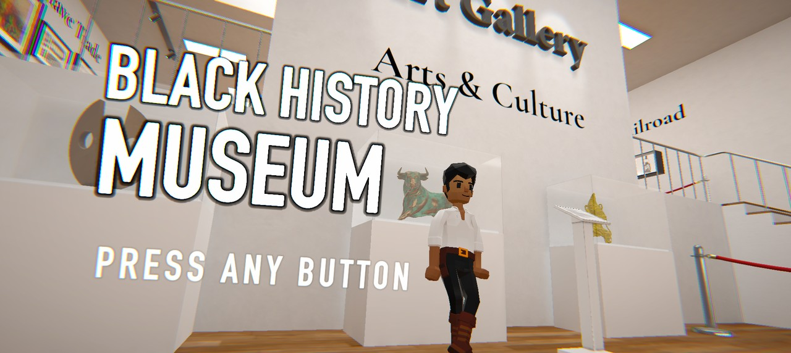

# Museum Game

A first-person Black history museum built in Unity. You walk between exhibits, listen to the narration for each one, and answer a question at the end of every room.

Exhibits cover figures and objects like Frederick Douglass, Madam C. J. Walker, Langston Hughes, Jackie Robinson, Mae Jemison, Nelson Mandela, Ketanji Brown Jackson, Benin brass plaques, and the Great Mosque of Djenne.

## Play

[id-game-delta.vercel.app](https://id-game-delta.vercel.app)

Runs in the browser, nothing to download.

## Run from source

1. Install Unity `6000.2.12f1`
2. Clone this repo, then add the folder in Unity Hub
3. Open `Assets/_Project/Scenes/MuseumTitle.unity` and press Play

Scenes play in this order: `MuseumTitle`, `MuseumGame`, `MuseumCredits`.

## Layout

| Path | What's in it |
| --- | --- |
| `Assets/_Project` | scenes, scripts, exhibit art and narration audio |
| `Assets/ThirdParty` | asset store packs |
| `Assets/Resources` | assets loaded at runtime |
| `Assets/Settings` | render pipeline settings |

## License

MIT, see [LICENSE](LICENSE).
